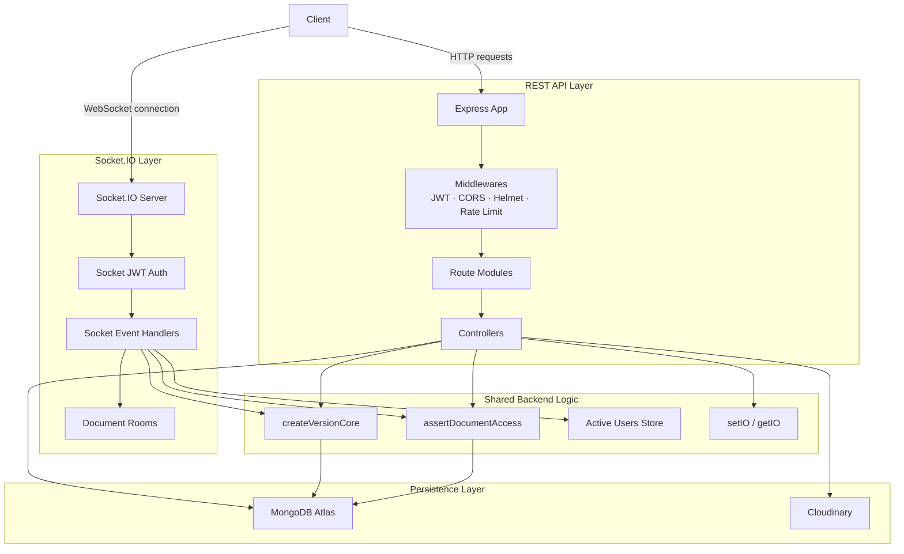

<h1 align="center">SyncScribe</h1>

<p align="center">
  A production-style REST + WebSocket backend for real-time collaborative document editing with JWT authentication, role-based access control, invite-link collaboration, Socket.IO rooms, optimistic concurrency control, and conflict-aware version history.
</p>

<p align="center">
  
  
  
  
  
  
  
</p>

---

## Table of Contents

* [Overview](#overview)
* [What SyncScribe Supports](#what-syncscribe-supports)
* [End-to-End Collaboration Flow](#end-to-end-collaboration-flow)
* [Architecture](#architecture)
* [Core Workflows](#core-workflows)
* [Role-Based Access Control](#role-based-access-control)
* [System Design Decisions](#system-design-decisions)
* [Key Data Model Decisions](#key-data-model-decisions)
* [API Coverage](#api-coverage)
* [Socket.IO Events](#socketio-events)
* [Testing](#testing)
* [Local Setup](#local-setup)
* [Environment Variables](#environment-variables)
* [Deployment Notes](#deployment-notes)
* [Project Status](#project-status)

---

## Overview

SyncScribe is a backend system for a real-time collaborative document editor. It provides REST APIs for authentication, document management, invite links, collaborators, trash/restore workflows, and version history. It also provides a Socket.IO layer for real-time document rooms, active-user presence, save events, and update broadcasts.

The project is designed around the main backend challenges of collaborative editing:

* preventing silent overwrites during concurrent saves
* preserving version history
* separating owner, editor, and viewer permissions
* supporting secure invite-based collaboration
* keeping REST and WebSocket behavior consistent
* verifying both API and real-time flows through testing assets

---

## What SyncScribe Supports

SyncScribe supports the complete backend flow for collaborative document editing:

* Users can register, log in, refresh tokens, update profile details, and manage avatar uploads.
* Owners can create documents and manage document metadata.
* Owners can create secure invite links for editors or viewers.
* Collaborators can preview and join documents through invite links.
* Owners can manage collaborators and update their roles.
* Authenticated users can connect to Socket.IO using JWT handshake authentication.
* Owners and editors can join document rooms and trigger saves.
* Viewers can read documents but cannot save changes.
* Saves are checked using optimistic concurrency control.
* Clean saves update canonical document content.
* Conflicted saves are preserved in version history without overwriting canonical content.
* Owners can soft-delete, restore, or permanently delete documents.
* Version history can be listed and reconstructed through REST APIs.
* REST and Socket.IO flows were tested separately.

---

## End-to-End Collaboration Flow

The main collaboration flow works as follows:

```txt
1. User registers or logs in and receives JWT tokens.
2. Owner creates a document.
3. The document starts with latestVersion = 1 and an initial snapshot version.
4. Owner creates an invite link with role = editor or viewer.
5. The raw invite token is returned once; only its SHA-256 hash is stored in MongoDB.
6. Collaborator previews the invite link.
7. Collaborator joins using the invite token through the joinViaInviteLink flow.
8. The server creates a Collaborator record and increments invite-link usage inside a transaction.
9. Owner and collaborator connect to Socket.IO using JWT handshake authentication.
10. Both users join the same document room through join_document.
11. The server emits active_users for the document room.
12. An editor sends trigger_save with content and baseVersionNumber.
13. The server checks access, compares baseVersionNumber with Document.latestVersion, and creates a version.
14. On clean save, canonical document content is updated and other users receive document_updated.
15. On conflict, canonical content remains unchanged and the saver receives conflict_detected.
16. Version history can be verified through REST version APIs.
```

This flow keeps collaboration, permissions, versioning, and real-time broadcasting connected through a single backend design.

---

## Architecture

SyncScribe uses two transport layers over the same backend data model:

* REST API for account, document, invite, collaborator, and version-management operations
* Socket.IO for real-time collaboration, room presence, save events, and broadcasts



### REST API Responsibilities

REST APIs handle operations that are request/response based:

```txt
Auth
Documents
Invite Links
Collaborators
Versions
Trash / Restore / Permanent Delete
```

Typical REST flow:

```txt
Client
  → Express route
  → JWT middleware
  → Controller
  → Access check
  → MongoDB operation
  → JSON response
```

### Socket.IO Responsibilities

Socket.IO handles operations that need live communication:

```txt
JWT socket authentication
Document room join
Active-user presence
Save trigger
Save confirmation
Document update broadcast
Conflict notification
Access removal notification
```

Typical Socket.IO save flow:

```txt
Client socket
  → socketAuthMiddleware
  → join_document
  → trigger_save
  → assertDocumentAccess
  → createVersionCore
  → MongoDB transaction
  → save_confirmed / document_updated / conflict_detected
```

### Shared Business Logic

The architecture avoids duplicating critical logic between REST and Socket.IO.

The central save/versioning service is:

```txt
services/versionService.js
```

The `createVersionCore` function owns the consistency-sensitive save flow:

* validates content and base version
* checks the current document version
* applies Compare-And-Swap
* updates canonical document content on clean saves
* creates immutable version records
* preserves conflicted saves
* runs document/version changes inside a MongoDB transaction

The centralized access utility is:

```txt
utils/assertDocumentAccess.js
```

It ensures owner/editor/viewer rules are enforced consistently across controllers and socket events.

---

## Core Workflows

### Authentication Flow

```txt
Register / Login
  → access token + refresh token issued
  → protected REST APIs use Bearer token
  → Socket.IO connection uses JWT in handshake auth
```

The same authenticated user identity is used by both REST requests and Socket.IO events.

---

### Document Lifecycle

```txt
Create document
  → initial snapshot version is created
  → document can be fetched, listed, searched, and updated
  → owner can soft delete
  → owner can restore
  → owner can permanently delete after soft delete
```

Permanent delete removes the document and dependent records only after the document is already in deleted state.

---

### Invite Link and Collaborator Join Flow

```txt
Owner creates invite link
  → raw token returned once
  → SHA-256 tokenHash stored in database
  → collaborator previews invite link
  → collaborator joins through invite token
  → usedCount increments
  → collaborator record is created
```

The join operation uses a MongoDB transaction because invite usage and collaborator creation must remain consistent.

The collaborator receives a role from the invite link:

```txt
editor → can read and save
viewer → can read only
```

---

### Real-Time Editing Flow

```txt
Socket connects with JWT
  → server verifies token during handshake
  → user joins document room with join_document
  → server verifies document access
  → server emits active_users
  → editor sends trigger_save
  → server checks editor permission
  → server runs version creation flow
```

On clean save:

```txt
Saver receives save_confirmed
Other users receive document_updated
Other users receive version_created
```

On conflicted save:

```txt
Saver receives conflict_detected
Submitted content is stored as conflicted version
Canonical document content remains unchanged
```

---

### Versioning and Conflict Handling Flow

When a user opens a document, the server returns the current document content and its `latestVersion`.

The client later sends that version back as `baseVersionNumber` during save.

```txt
getDocument
  → returns document content + latestVersion

client edits document

trigger_save
  → sends updated content + baseVersionNumber
```

The server compares:

```txt
baseVersionNumber from client
against
latestVersion stored on Document
```

If both match, the save is clean.

If they do not match, another save has already moved the document forward. The new content is stored as conflicted history, but the canonical document is not overwritten.

This design prevents silent data loss while preserving the user's attempted save.

---

### Trash and Access Cleanup Flow

Soft delete does not immediately remove all data. It marks the document as deleted.

```txt
Owner soft deletes document
  → document status becomes deleted
  → document_deleted is emitted to active sockets
  → sockets are removed from the document room
  → active-user tracking is cleared
```

Restore changes the document back to active.

Permanent delete removes:

```txt
Document
Versions
Collaborators
Invite Links
```

inside a transaction.

---

## Role-Based Access Control

SyncScribe supports three access levels.

| Role     | How Assigned                     | Capabilities                                                                                           |
| -------- | -------------------------------- | ------------------------------------------------------------------------------------------------------ |
| `owner`  | Document creator                 | Full control over document, collaborators, invite links, trash, restore, purge, and contribution stats |
| `editor` | Invite link or owner role update | Read document and save changes through Socket.IO                                                       |
| `viewer` | Invite link or owner role update | Read-only document access                                                                              |

Access checks are centralized through:

```js
assertDocumentAccess(documentId, userId, {
  requireOwner,
  requireEditor,
  selectFields,
});
```

This utility resolves access from:

```txt
Document ownership
Collaborator membership
Collaborator role
Document active/deleted status
```

For `trigger_save`, editor access is checked on every socket save event. This prevents stale sockets from retaining edit permission after an owner changes a collaborator from `editor` to `viewer`.

---

## System Design Decisions

### 1. Optimistic Concurrency Control with Compare-And-Swap

SyncScribe uses a document-level version counter for concurrency control.

The document stores:

```js
latestVersion: Number
```

The client sends:

```js
baseVersionNumber: Number
```

The server updates the canonical document only when the stored version still matches the client's base version:

```js
Document.findOneAndUpdate(
  {
    _id: documentId,
    status: "active",
    latestVersion: baseVersionNumber,
  },
  {
    $set: {
      content: documentContent,
      lastEditedBy: userId,
      lastEditedAt: now,
    },
    $inc: {
      latestVersion: 1,
    },
  },
  {
    new: true,
    session,
  }
);
```

This is the Compare-And-Swap step.

Clean save result:

```txt
Document content updated
latestVersion incremented
new Version record created
save_confirmed emitted
document_updated broadcast to other users
```

Conflict result:

```txt
Document content not overwritten
conflicted Version record created
wasConflicted = true
basedOnVersion preserved
conflict_detected emitted to saver
```

---

### 2. Conflict-Aware Version Metadata

Version records include fields that make conflict history auditable.

| Field            | Purpose                                                   |
| ---------------- | --------------------------------------------------------- |
| `basedOnVersion` | Stores the version number the client edited from          |
| `wasConflicted`  | Marks whether the save failed the version check           |
| `saveType`       | Identifies `autosave`, `manual`, or `conflict_resolution` |
| `createdBy`      | Tracks the user who created the version                   |
| `versionNumber`  | Maintains document-level version ordering                 |

This allows the backend to preserve both successful saves and conflicting save attempts without losing submitted content.

---

### 3. Snapshot/Diff Hybrid Version Storage

SyncScribe stores version history using a snapshot/diff hybrid approach.

Full snapshots are stored periodically. Diff versions store patch data and a direct reference to the nearest clean snapshot.

```txt
Version 1   → snapshot
Version 2   → diff       snapshotRef → Version 1
Version 3   → diff       snapshotRef → Version 1
...
Version 10  → diff       snapshotRef → Version 1
Version 11  → snapshot
Version 12  → diff       snapshotRef → Version 11
```

Snapshots are created on the initial version and then periodically:

```js
(newVersionNumber - 1) % SNAPSHOT_INTERVAL === 0
```

Reconstruction flow:

```txt
Fetch target version
  → if snapshot, return content directly
  → if diff, fetch snapshotRef
  → apply patch to snapshot content
  → return reconstructed content
```

Conflicted versions are excluded from snapshot eligibility to avoid breaking the clean snapshot chain.

---

### 4. Immutable Version History

Version records are treated as append-only audit records.

The schema blocks common update paths:

```js
versionSchema.pre("save", function () {
  if (!this.isNew) {
    throw new Error("Version documents are immutable");
  }
});

["findOneAndUpdate", "updateOne", "updateMany", "findByIdAndUpdate"].forEach(
  (op) => {
    versionSchema.pre(op, function () {
      throw new Error(`Version documents are immutable — '${op}' is not allowed`);
    });
  }
);
```

This reduces the risk of accidental mutation of historical versions.

---

### 5. Secure Invite Tokens

Invite links use random raw tokens. Only the SHA-256 hash of the token is stored.

```js
const hashToken = (token) =>
  crypto.createHash("sha256").update(token).digest("hex");
```

The raw token is returned once when the invite link is created. Later preview/join requests hash the submitted token and compare it with the stored hash.

This prevents raw invite URLs from being directly exposed through database records.

---

### 6. Atomic Invite Join

Joining through an invite link requires two related writes:

```txt
Increment invite link usedCount
Create collaborator record
```

Both operations run inside a MongoDB transaction.

If collaborator creation fails, the invite usage increment is rolled back. The collaborator collection also enforces uniqueness on:

```js
{ document: 1, user: 1 }
```

This prevents duplicate collaborator membership and avoids phantom invite usage.

---

### 7. Transaction-Safe Permanent Delete

Permanent delete is allowed only after soft delete.

The purge operation removes dependent records sequentially inside a MongoDB transaction:

```js
session.startTransaction();

try {
  await Version.deleteMany({ documentId }, { session });
  await Collaborator.deleteMany({ document: documentId }, { session });
  await InviteLink.deleteMany({ document: documentId }, { session });

  await Document.findOneAndDelete(
    {
      _id: documentId,
      owner: userId,
      status: "deleted",
    },
    { session }
  );

  await session.commitTransaction();
} catch (err) {
  if (session.inTransaction()) {
    await session.abortTransaction();
  }

  throw err;
}
```

Sequential operations are used inside the transaction to avoid session conflicts while keeping the purge atomic.

---

### 8. Socket Room Cleanup on Access Changes

When a document is deleted, users should not remain inside a stale room.

```js
io.to(roomId).emit("document_deleted", {
  docId: roomId,
  deletedBy: userId,
});

io.in(roomId).socketsLeave(roomId);
clearActiveDocumentUsers(roomId);
```

When a collaborator is removed, that user's sockets receive `document_access_removed` and are removed from the document room.

---

### 9. Socket.IO JWT Handshake Authentication

Socket.IO authentication happens during the connection handshake.

```js
io("http://localhost:5000", {
  auth: {
    token: accessToken,
  },
});
```

After verification, the server attaches identity to the socket object:

```js
socket.userId = decodedUserId;
socket.username = user.username;
```

Socket events use this server-side identity instead of trusting user IDs from client payloads.

---

## Key Data Model Decisions

| Model          | Key Fields                                                                                                             | Purpose                                                          |
| -------------- | ---------------------------------------------------------------------------------------------------------------------- | ---------------------------------------------------------------- |
| `Document`     | `owner`, `status`, `content`, `latestVersion`, `lastEditedBy`, `lastEditedAt`                                          | Stores canonical document state and powers OCC                   |
| `Version`      | `versionNumber`, `type`, `content`, `delta`, `snapshotRef`, `basedOnVersion`, `wasConflicted`, `saveType`, `createdBy` | Stores immutable clean/conflicted version history                |
| `Collaborator` | `document`, `user`, `role`, `invitedBy`                                                                                | Stores document membership and editor/viewer permission          |
| `InviteLink`   | `document`, `tokenHash`, `role`, `maxUses`, `usedCount`, `expiresAt`, `isActive`                                       | Supports secure, limited, revocable invite links                 |
| `User`         | `username`, `email`, `password`, `avatar`, `refreshToken`                                                              | Supports authentication, profile, avatar, and token refresh flow |

---

## API Coverage

SyncScribe exposes REST APIs across five backend domains.

| Domain        | Covered Features                                                                                                     |
| ------------- | -------------------------------------------------------------------------------------------------------------------- |
| Auth          | register, login, logout, refresh token, current user, password update, account update, avatar update, public profile |
| Documents     | create, read, owned list, shared list, search, update metadata, soft delete, restore, deleted list, permanent delete |
| Invite Links  | create invite link, list invite links, preview invite link, join through invite link, revoke invite link             |
| Collaborators | list collaborators, update role, remove collaborator, leave shared document                                          |
| Versions      | list version history, reconstruct version content, contribution summary                                              |

Executable Postman requests and testing notes are available in:

```txt
/testing/postman
```

---

## Socket.IO Events

Socket.IO powers real-time collaboration and save broadcasting.

### Client to Server

| Event            | Payload                                                    | Description                                               |
| ---------------- | ---------------------------------------------------------- | --------------------------------------------------------- |
| `join_document`  | `{ docId }`                                                | Joins a document room after access verification           |
| `trigger_save`   | `{ docId, content, baseVersionNumber, label?, saveType? }` | Saves document content using OCC and version creation     |
| `leave_document` | `{ docId }`                                                | Leaves a document room if supported by the socket handler |

### Server to Client

| Event                     | Recipient        | Description                                                        |
| ------------------------- | ---------------- | ------------------------------------------------------------------ |
| `document_joined`         | Sender           | Confirms successful room join                                      |
| `active_users`            | Room             | Sends the current active users for a document room                 |
| `save_confirmed`          | Saver            | Confirms clean save and returns saved version details              |
| `conflict_detected`       | Saver            | Notifies that the save failed the version check                    |
| `document_updated`        | Other room users | Broadcasts latest document content after clean save                |
| `version_created`         | Other room users | Notifies room users that a version was created                     |
| `document_deleted`        | Room             | Notifies users that the document was deleted                       |
| `document_access_removed` | Removed user     | Notifies collaborator that access was removed                      |
| `socket_error`            | Sender           | Sends event-level errors without terminating the socket connection |

Socket.IO testing scripts and notes are available in:

```txt
/testing/socket-io
```

---

## Testing

SyncScribe includes testing assets under the `/testing` directory. REST APIs and real-time Socket.IO flows were tested separately to verify both request/response behavior and live collaboration behavior.

| Area              | Location             | Verification                                                                                                               |
| ----------------- | -------------------- | -------------------------------------------------------------------------------------------------------------------------- |
| REST API Testing  | `/testing/postman`   | Postman collection, environment template, and testing notes for Auth, Documents, Invite Links, Collaborators, and Versions |
| Socket.IO Testing | `/testing/socket-io` | Terminal-based `socket.io-client` scripts and testing notes for real-time collaboration flow                               |

### REST API Verification

REST APIs were verified using Postman across the main backend domains.

| Domain        | Verified Flows                                                                                                               |
| ------------- | ---------------------------------------------------------------------------------------------------------------------------- |
| Auth          | register, login, current user, change password, update account, update avatar, refresh token, logout                         |
| Documents     | create, get document, owned list, shared list, search, update metadata, soft delete, restore, deleted list, permanent delete |
| Invite Links  | create invite link, list invite links, preview invite link, join through invite link, revoke invite link                     |
| Collaborators | list collaborators, update collaborator role, remove collaborator, collaborator leave                                        |
| Versions      | list versions, get reconstructed version content, contribution summary                                                       |

The Postman environment uses scripts to persist runtime values across requests, including:

```txt
accessToken
ownerAccessToken
collabAccessToken
ownerId
collabUserId
documentId
versionId
inviteToken
inviteLinkId
collaboratorId
baseVersionNumber
```

Real JWTs, invite tokens, generated IDs, and environment-specific secrets are excluded from the repository.

### Socket.IO Verification

Real-time collaboration was verified using terminal-based Socket.IO client scripts.

The socket testing flow verifies:

* JWT-based Socket.IO handshake authentication
* owner and collaborator connecting as separate authenticated users
* both users joining the same document room through `join_document`
* `active_users` emission after room join
* owner triggering a document save through `trigger_save`
* owner receiving `save_confirmed`
* collaborator receiving `document_updated`
* collaborator receiving `version_created`
* version persistence confirmed afterward through REST version APIs

This confirms that REST APIs and real-time collaboration were tested separately, and that Socket.IO saves integrate with the same version-history system used by the REST version endpoints.

---

## Local Setup

```bash
git clone https://github.com/adarshV-0707/syncscribe-api.git
cd syncscribe-api
npm install
cp .env.sample .env
npm run dev
```

The REST API and Socket.IO server run on the same port.

```txt
REST API: http://localhost:5000/api/v1
Socket.IO: http://localhost:5000
```

---

## Environment Variables

Create a `.env` file from `.env.sample`.

| Variable                | Purpose                        |
| ----------------------- | ------------------------------ |
| `PORT`                  | Server port                    |
| `CORS_ORIGIN`           | Allowed frontend/client origin |
| `MONGODB_URI`           | MongoDB connection string      |
| `ACCESS_TOKEN_SECRET`   | JWT access token secret        |
| `ACCESS_TOKEN_EXPIRY`   | Access token expiry            |
| `REFRESH_TOKEN_SECRET`  | JWT refresh token secret       |
| `REFRESH_TOKEN_EXPIRY`  | Refresh token expiry           |
| `CLOUDINARY_CLOUD_NAME` | Cloudinary cloud name          |
| `CLOUDINARY_API_KEY`    | Cloudinary API key             |
| `CLOUDINARY_API_SECRET` | Cloudinary API secret          |

Real secrets are not committed. Use `.env.sample` as the reference template.

---

## Deployment Notes

The backend is designed to be deployable on:

```txt
AWS EC2 Free Tier + MongoDB Atlas M0
```

Production deployment checklist:

* set `NODE_ENV=production`
* use strong JWT secrets
* restrict `CORS_ORIGIN` to the deployed frontend origin
* do not expose stack traces in production error responses
* whitelist only the server IP in MongoDB Atlas
* use HTTPS in production
* run the Node.js process with a process manager such as PM2
* configure reverse proxy support if running behind Nginx
* keep real `.env` values outside GitHub

---

## Project Status

* REST API implementation completed
* Postman REST testing completed
* Socket.IO terminal testing completed
* Invite-link and collaborator flows implemented and verified
* Version history and conflict-aware save flow implemented
* Backend ready for deployment environment configuration

---

<p align="center">
  Built by <a href="https://github.com/adarshV-0707">Adarsh Verma</a>
</p>
